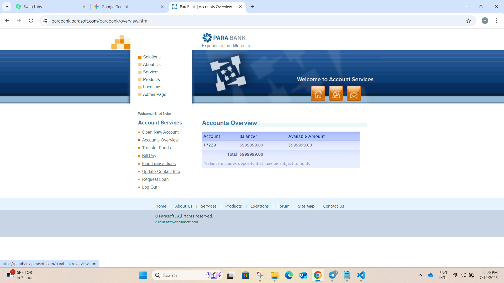
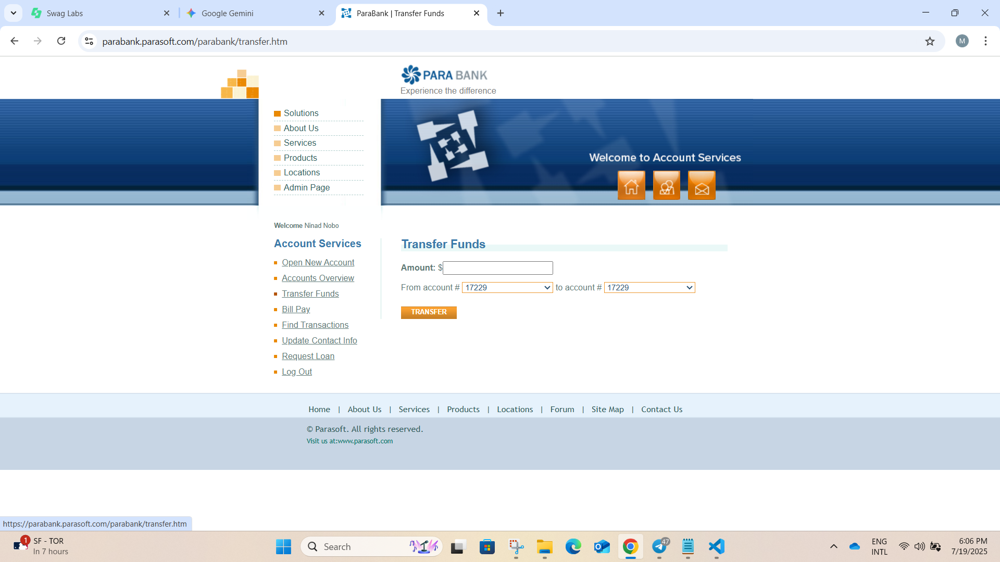
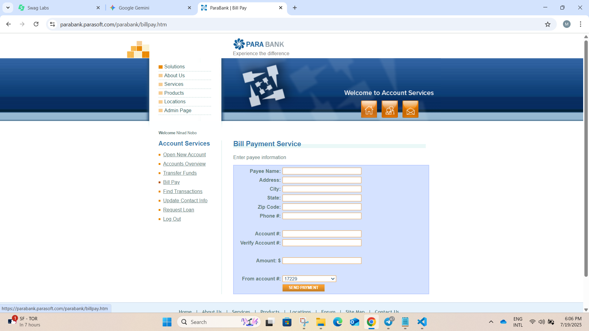
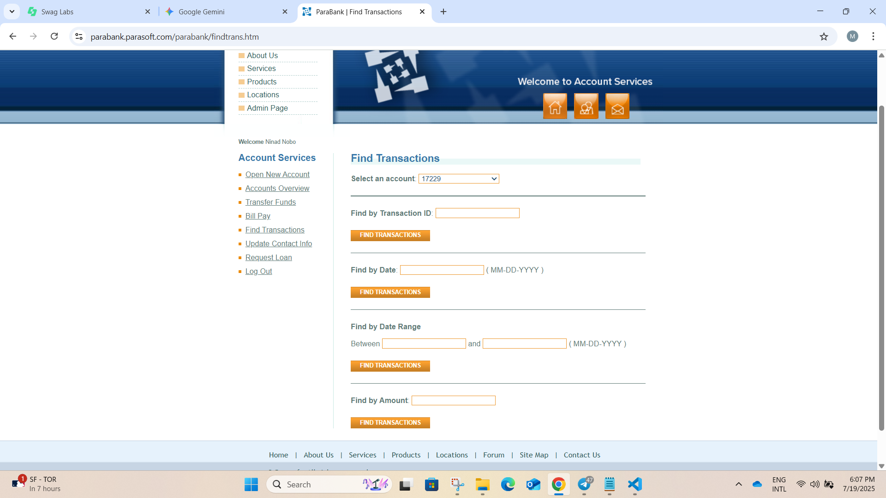
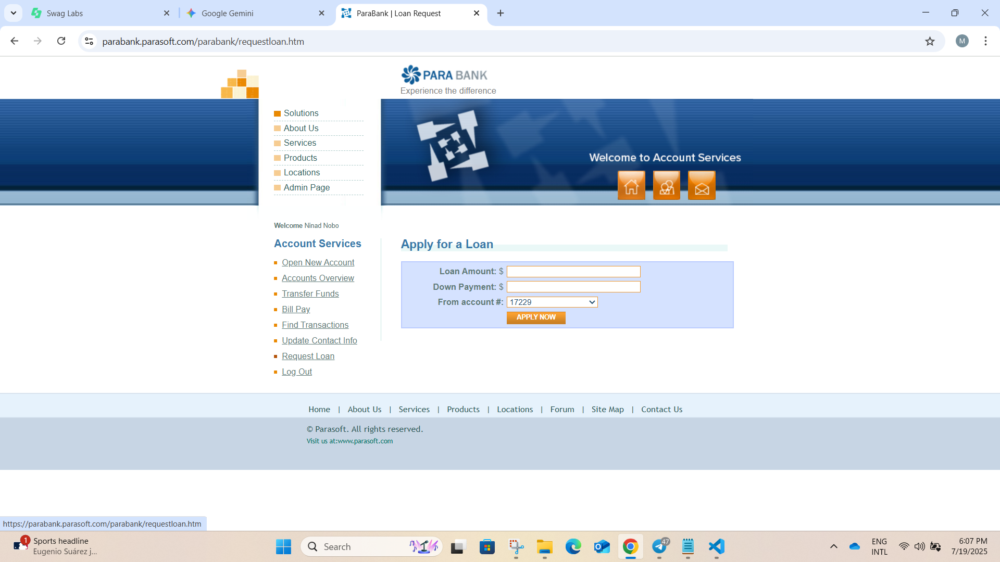

# Parabank Functional Overview

**Website URL:** [https://parabank.parasoft.com/parabank/index.htm](https://parabank.parasoft.com/parabank/index.htm)

**Navigation:** Parabank is a sample banking application provided by Parasoft for testing purposes. When visitors arrive, they see the sign-in page, which offers an Email / Username and Password form, a Register link for new customers, and a Forgot Password? link for credential recovery. After a successful log-in, users reach their account dashboard displaying every account and balance. A left-hand navigation menu now contains the following options: Accounts Overview (default dashboard view), Open New Account, Transfer Funds, Bill Pay, Request Loan, Update Contact Info, and Log Out.

## 1. Login

The login page displays the ParaBank header and primary navigation links (Solutions, About Us, Services, Products, Locations, Admin Page) on the left and quick-access icons (Home, Profile, Messages) at the top. Below that is the Customer Login form with two text inputs—Username (or Email) and Password—and a Log In button. Directly beneath the button are the “Forgot login info?” link and a “Register” link for new users. When the user clicks Log In, the system submits the credentials to the server. If they match a registered account, the user is immediately taken to their account dashboard. If they do not match (or any error occurs during authentication), the same error banner “An internal error has occurred and has been logged. Please try again later.” is shown, both input fields remain populated, and the user can correct their entry and click Log In again.

## 2. Forgot Password

The Forgot Login Info page displays the ParaBank header and primary navigation links (Solutions, About Us, Services, Products, Locations, Admin Page) alongside the Home, Profile and Messages icons. The left sidebar contains the Customer Login form with Username and Password fields, a Log In button, and links for “Forgot login info?” and “Register.” The main content area presents a Customer Lookup form with seven required fields—First Name, Last Name, Address, City, State, Zip Code and SSN. If any field is left blank, the user is prompted to complete it before submitting. Once all fields are entered and the “Find My Login Info” button is clicked, the system attempts to match the information to a customer record. If no matching record is found, the page displays the error banner:
"Error! The customer information provided could not be found." If a matching record is found, the page displays the appropriate recovery details.

## 3. Register

 The registration page contains a customer sign-up form with required inputs for First Name, Last Name, Street Address, City, State, ZIP Code, Phone Number, Social Security Number, Username, Password, and Confirm Password, plus a ‘Register’ button. The Username must be unique. The Password must be at least 8 characters, include a number and a special character, and must match the Confirm Password field. On submission, the system validates every field for completeness and proper format (e.g., ZIP and SSN patterns). If validation passes, it creates the new customer record, shows the success message ‘Account created successfully — please sign in.’, and redirects the user to the login page; otherwise it displays specific error messages beside any invalid fields and allows correction before resubmission.

## 4. Account Dashboard

 After login or registration, users are taken to the Account Dashboard. If the user has just registered, a welcome message such as "Your account was created successfully. The left side of the page always shows the Account Services navigation menu, including options like Accounts Overview, Open New Account, Transfer Funds, Bill Pay, Find Transactions, Update Contact Info, Request Loan, and Log Out. If the user has no accounts yet, the main area displays a message like “You have no accounts yet.” and provides a shortcut to open a new account. If the user has accounts, a table is shown listing each account with columns for Account Number (as a clickable link), Account Type (Checking or Savings), and Current Balance. At the bottom, a footer summarizes the Total Balance across all accounts. If there is a problem loading data, an error message is displayed and logged for support.

## 5. Open New Account

 The new-account page presents an account-opening form that requires the user to pick an Account Type (Checking or Savings) from a dropdown, enter the Initial Deposit Amount, choose a Funding Source Account from existing accounts, and click “Open Account.” On submission, the system validates that all fields are filled, confirms the deposit meets the minimum for the selected type, and checks that the funding account’s available balance covers the amount; if all validations succeed, it debits the source account, credits the new account, generates a unique account number, and displays “Account created successfully.” along with the new account number and starting balance, while any failure—such as insufficient funds—triggers a clear error message, highlights the problematic field, and allows correction before resubmission.

## My Account

The My Account page displays a detailed dashboard for a selected account. It shows the account number, account type (Checking or Savings), and the current balance. Below, it lists all transactions for the account, including dates, descriptions, amounts, and running balances. Users can review their transaction history, check for recent deposits or withdrawals, and verify their current balance. This page helps users monitor account activity and manage their finances effectively.

## 6. Transfer Funds

 The fund-transfer page presents a transfer form that requires the user to enter a Transfer Amount, choose a Source Account from a dropdown of their eligible accounts, and specify the Destination Account—either by selecting one of their own linked accounts or by typing an external account number with an optional Confirm Account Number field—followed by a “Transfer” button. When submitted, the system validates every input for presence and format, confirms that any duplicated account-number fields match, verifies that the source account’s available balance covers the requested amount, and checks the destination account’s validity. If all checks pass, it immediately posts the debit and credit, updates the displayed balances, and shows the explicit success message “Transfer completed successfully.” along with a transaction reference; if any check fails, it displays a clear error message such as “Insufficient funds” or “Invalid destination account,” highlights the affected fields, and allows the user to correct and resubmit.

## 7. Bill payments

 The bill-payment page contains a payment form with required inputs for Payee Name, Street Address, City, State, ZIP Code, Phone Number, Payee Account Number plus a Confirm Account Number field, Payment Amount, and a Source Account drop-down, finished by a “Pay” button. On submission, the system validates each entry for presence and format, confirms that the two account-number fields match, verifies that the selected source account holds sufficient available funds, and then executes the payment to the external payee. If all checks pass, it displays “Payment submitted successfully.” along with a transaction reference and updates the account balance; if any validation or balance check fails, it shows a clear error message such as “Insufficient funds” or “Account numbers do not match,” highlights the problematic fields, and lets the user correct and resubmit.

## 8. Find Transaction

 The transaction search page allows users to find specific transactions by entering criteria such as date range, amount, or description. Matching results are displayed in a list for review. If no transactions are found, a message is shown to the user.

## 9. Update Profile

 The customer-profile page presents an editable form pre-populated with the user’s current First Name, Last Name, Street Address, City, State, ZIP Code, and Phone Number, along with an “Update Profile” button. When the user edits any field and submits, the system validates each entry—checking, for example, that the phone number matches the required format and that all address components are complete and logically consistent—then saves the changes and synchronizes them across all relevant services. If every check passes, it displays “Profile updated successfully.” and refreshes the page to show the new data; otherwise it highlights any invalid fields, shows an inline error banner explaining what needs fixing, and allows the user to correct and resubmit.

## 10. Request Loan

 The loan-application page presents a loan request form requiring the customer to enter the Loan Amount, specify a Down-Payment Amount (which must be numerically less than the loan amount), choose a Collateral Account from a dropdown of eligible accounts, and press “Apply”. Upon submission, the system checks every field for completeness and correct numeric format, verifies that sufficient funds exist to cover the down payment, confirms the collateral account’s value meets policy thresholds, and then runs an automated credit evaluation that factors in the customer’s account history, current balances, and collateral valuation. If the application qualifies, the system debits the down-payment funds, earmarks the collateral, creates a new loan account, and displays “Loan approved and created successfully.” along with the account number, disbursement schedule, and repayment terms; if the request is denied, it returns “Loan application denied” followed by specific reasons (e.g., “Insufficient collateral value” or “Account history does not meet criteria”) and allows the customer to adjust inputs or contact support.

 ## Logout
 The logout function securely ends the user session, clears any sensitive data from the session, and returns the user to the login page. This ensures that no account information remains accessible after logout.
