# Parabank Functional Overview

**Website URL:** [https://parabank.parasoft.com/parabank/index.htm](https://parabank.parasoft.com/parabank/index.htm)

**Navigation:** ParaBank is a sample banking application provided by Parasoft for testing purposes. When a visitor arrives, they see the Sign-In page with fields for Email/Username and Password, a Sign In button, plus “Register” and “Forgot Password?” links for new-user signup and credential recovery. After successful authentication, the user lands on the Accounts Overview dashboard, which displays each account number alongside its Balance and Available Amount. A left-hand menu under the “Account Services” heading offers quick access to Accounts Overview (the default view), Open New Account, Transfer Funds, Bill Pay, Request Loan, Update Contact Info and Log Out.

## 1. Login
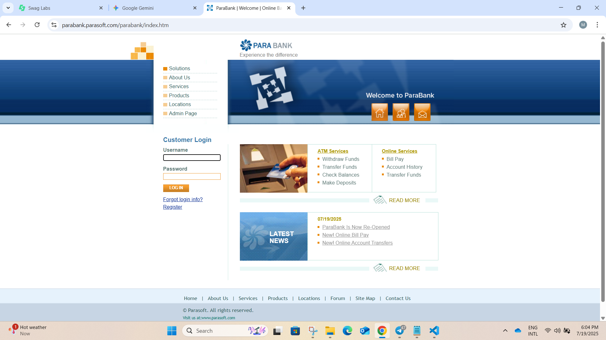
The login page displays the ParaBank header and primary navigation links (Solutions, About Us, Services, Products, Locations, Admin Page) on the left and quick-access icons (Home, Profile, Messages) at the top. Below that is the Customer Login form with two text inputs—Username (or Email) and Password—and a Log In button. Directly beneath the button are the “Forgot login info?” link and a “Register” link for new users. When the user clicks Log In, the system submits the credentials to the server. If they match a registered account, the user is immediately taken to their account dashboard. If they do not match (or any error occurs during authentication), the same error banner “An internal error has occurred and has been logged. Please try again later.” is shown, both input fields remain populated, and the user can correct their entry and click Log In again.

## 2. Forgot Password
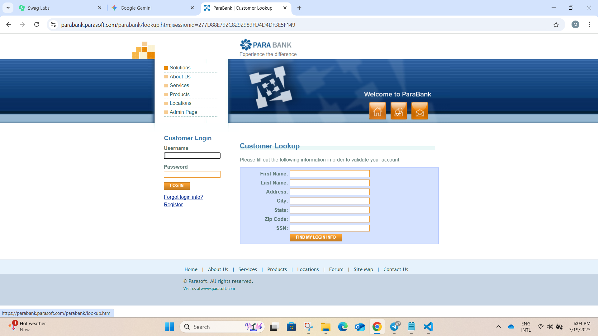
The Forgot Login Info page displays the ParaBank header and primary navigation links (Solutions, About Us, Services, Products, Locations, Admin Page) alongside the Home, Profile and Messages icons. The left sidebar contains the Customer Login form with Username and Password fields, a Log In button, and links for “Forgot login info?” and “Register.” The main content area presents a Customer Lookup form with seven required fields—First Name, Last Name, Address, City, State, Zip Code and SSN. If any field is left blank, the user is prompted to complete it before submitting. Once all fields are entered and the “Find My Login Info” button is clicked, the system attempts to match the information to a customer record. If no matching record is found, the page displays the error banner:
"Error! The customer information provided could not be found." If a matching record is found, the page displays the appropriate recovery details.

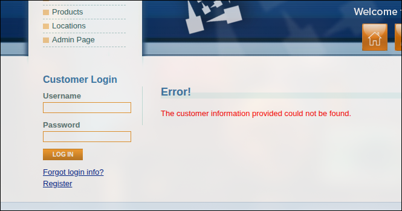

## 3. Register
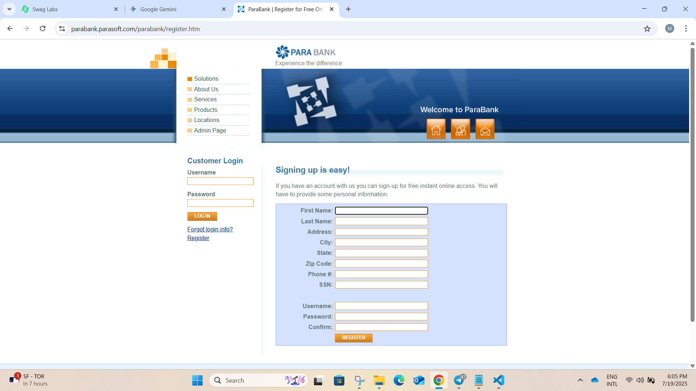
The Register page displays the ParaBank header and primary navigation links (Solutions, About Us, Services, Products, Locations, Admin Page) alongside the Home, Profile and Messages icons. The left sidebar contains the Customer Login form with Username and Password fields, a Log In button, and links for “Forgot login info?” and “Register.” The main content area presents a registration form with eleven fields—First Name, Last Name, Address, City, State, Zip Code, Phone #, SSN, Username, Password and Confirm Password—all of which are mandatory and impose no additional format or content constraints. A Register button submits the form; upon clicking it, the system creates the new account, automatically logs the user in, and displays “Your account was created successfully. You are now logged in."

## 4. Open New Account

The Open New Account page displays the ParaBank header and primary navigation links (Solutions, About Us, Services, Products, Locations, Admin Page) alongside the Home, Profile and Messages icons. The left sidebar is titled Account Services and lists all available actions—Open New Account, Accounts Overview, Transfer Funds, Bill Pay, Find Transactions, Update Contact Info, Request Loan and Log Out—with Open New Account highlighted. The main content area presents a form where the user selects the account type (Savings or Checking) from a dropdown, then chooses one of their existing accounts as the funding source for the required $100.00 opening deposit. Clicking Open New Account deducts $100.00 from the selected source account and attempts to create the new account. If all validations succeed, it debits the source account, credits the new account, generates a unique account number, and displays “Account created successfully.” along with the new account number and the page displays: "Account Opened! Congratulations, your account is now open. Your new account number: [account number]".

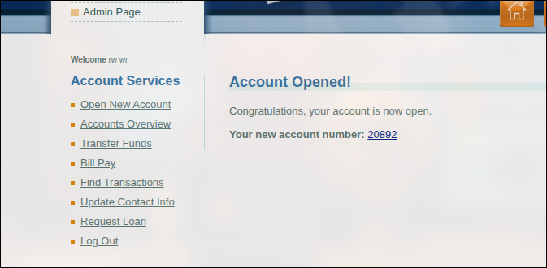

## 5. Account Overview
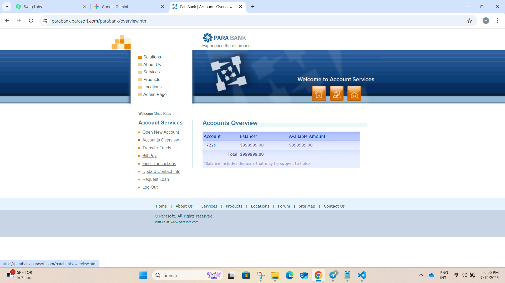
The Accounts Overview page displays the ParaBank header and primary navigation links (Solutions, About Us, Services, Products, Locations, Admin Page) alongside the Home, Profile and Messages icons. The left sidebar, titled Account Services, lists all actions—Open New Account, Accounts Overview, Transfer Funds, Bill Pay, Find Transactions, Update Contact Info, Request Loan and Log Out—with Accounts Overview highlighted. The main content area opens with the heading “Accounts Overview” above a table showing every account owned by the customer. Each row presents the account number alongside its current Balance and Available Amount. At the bottom of the table, the combined total balance across all accounts is shown.

## 6. Transfer Funds
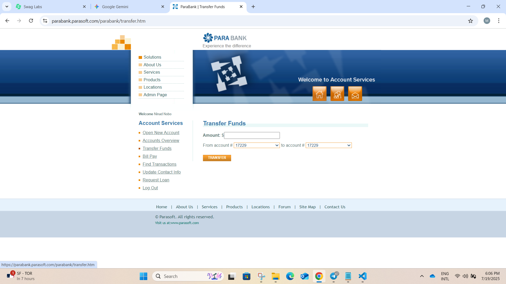
The Transfer Funds page displays the ParaBank header and primary navigation links (Solutions, About Us, Services, Products, Locations, Admin Page) alongside the Home, Profile and Messages icons. The left sidebar, titled Account Services, lists all actions—Open New Account, Accounts Overview, Transfer Funds, Bill Pay, Find Transactions, Update Contact Info, Request Loan and Log Out—with Transfer Funds highlighted. The main content area opens with the heading “Transfer Funds” above a form containing an Amount field and two dropdowns labeled From account # and To account # for selecting existing accounts. After the user enters a value and selects both source and destination accounts and clicks Transfer, the page displays: "Transfer Complete! amount has been transferred from account _ to account _.See Account Activity for more details."

## 7. Bill payments
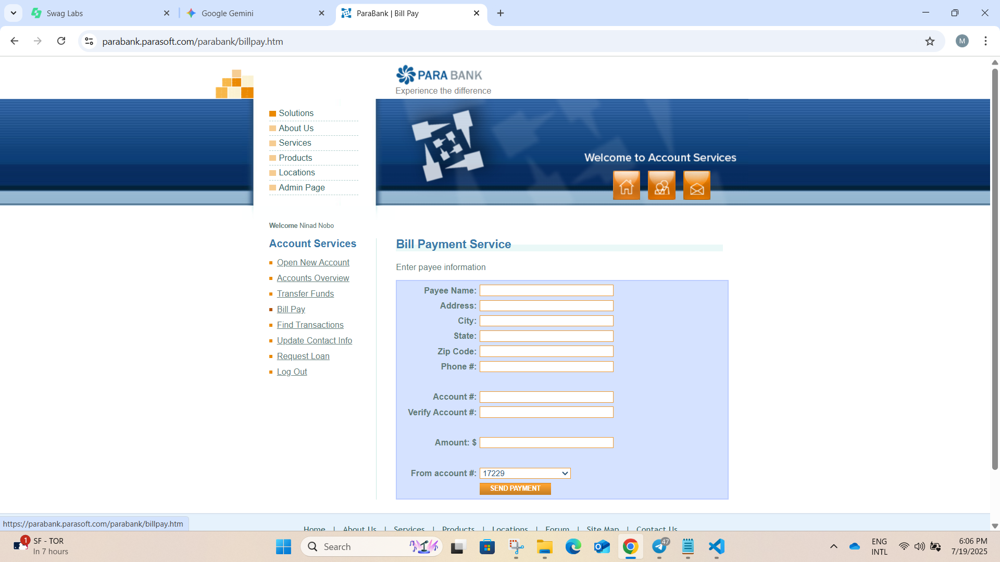
The Bill Pay page displays the ParaBank header and primary navigation links (Solutions, About Us, Services, Products, Locations, Admin Page) alongside the Home, Profile and Messages icons. The left sidebar, titled Account Services, lists all actions—Open New Account, Accounts Overview, Transfer Funds, Bill Pay, Find Transactions, Update Contact Info, Request Loan and Log Out—with Bill Pay highlighted. The main content area opens with the heading “Bill Payment Service” above a form containing required fields for Payee Name, Address, City, State, Zip Code, Phone #, Account #, Verify Account #, Amount and a From account # dropdown. After all fields are completed and the user clicks Send Payment, the page displays: "Bill Payment Complete. Bill Payment to user_ in the amount _ from account _  was successful. See Account Activity for more details."

## 8. Find Transaction
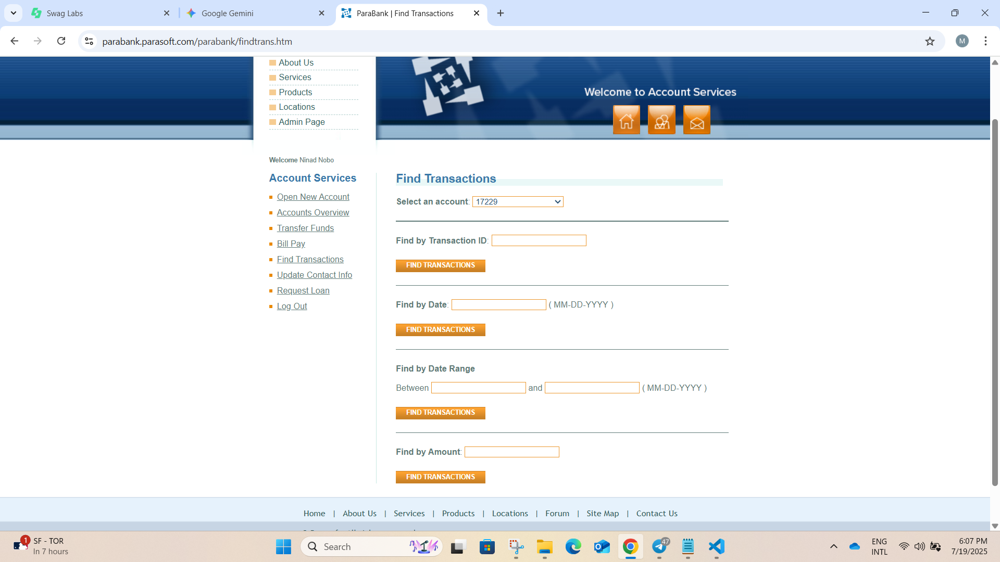
The Find Transactions page displays the ParaBank header and primary navigation links (Solutions, About Us, Services, Products, Locations, Admin Page) alongside the Home, Profile and Messages icons. The left sidebar, titled Account Services, lists all actions—Open New Account, Accounts Overview, Transfer Funds, Bill Pay, Find Transactions, Update Contact Info, Request Loan and Log Out—with Find Transactions highlighted. The main content area opens with the heading “Find Transactions” above a dropdown for selecting an account and four search panels—Find by Transaction ID, Find by Date, Find by Date Range, and Find by Amount—each with its own input field and a Find Transactions button. All fields are required and dates must be entered in MM-DD-YYYY format; if a user submits invalid or empty input, an inline validation message appears next to the offending field. When a valid search is submitted, the system returns any matching transactions in a results table showing details such as Transaction ID, Date, Description and Amount. If error occurs during the lookup, the page displays the error banner: "Error! An internal error has occurred and has been logged."

## 9. Update Profile
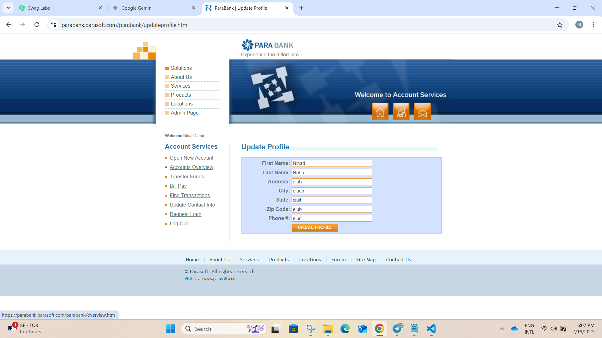
The Update Profile page displays the ParaBank header and primary navigation links (Solutions, About Us, Services, Products, Locations, Admin Page) alongside the Home, Profile and Messages icons. The left sidebar, titled Account Services, lists all actions—Open New Account, Accounts Overview, Transfer Funds, Bill Pay, Find Transactions, Update Contact Info, Request Loan and Log Out—with Update Contact Info highlighted. The main content area opens with the heading “Update Profile” above a form containing required fields for First Name, Last Name, Address, City, State, Zip Code and Phone #, plus an Update Profile button. Upon successful submission, the page displays: "Profile Updated. Your updated address and phone number have been added to the system."

## 10. Request Loan
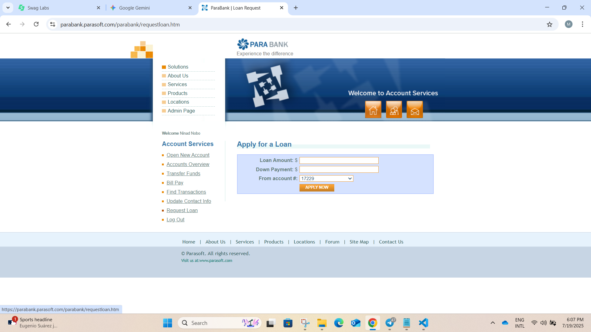
 The Apply for a Loan page displays the ParaBank header and primary navigation links (Solutions, About Us, Services, Products, Locations, Admin Page) alongside the Home, Profile and Messages icons. The left sidebar, titled Account Services, lists all actions—Open New Account, Accounts Overview, Transfer Funds, Bill Pay, Find Transactions, Update Contact Info, Request Loan and Log Out—with Request Loan highlighted. The main content area opens with the heading “Apply for a Loan” above a form containing three mandatory inputs—Loan Amount, Down Payment and a From account # dropdown—and an Apply Now button. When Apply Now is clicked and all fields are filled correctly, the page displays:"Loan Approved! Your loan has been approved."
 If any field is left blank or an internal error occurs, the page displays: "Error! An internal error has occurred and has been logged."

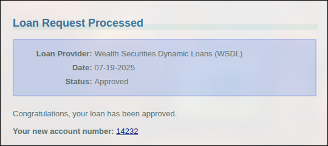

 ## Logout
 The logout function securely ends the user session, clears any sensitive data from the session, and returns the user to the login page. This ensures that no account information remains accessible after logout.
