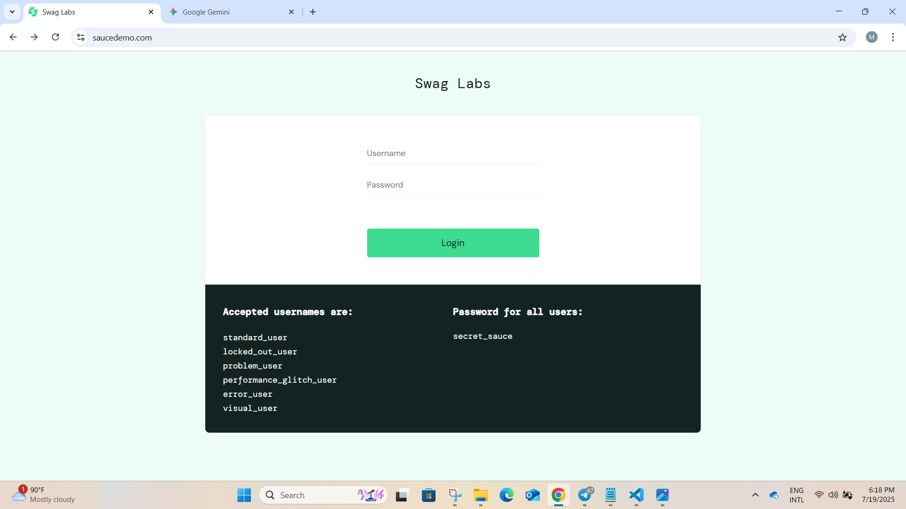
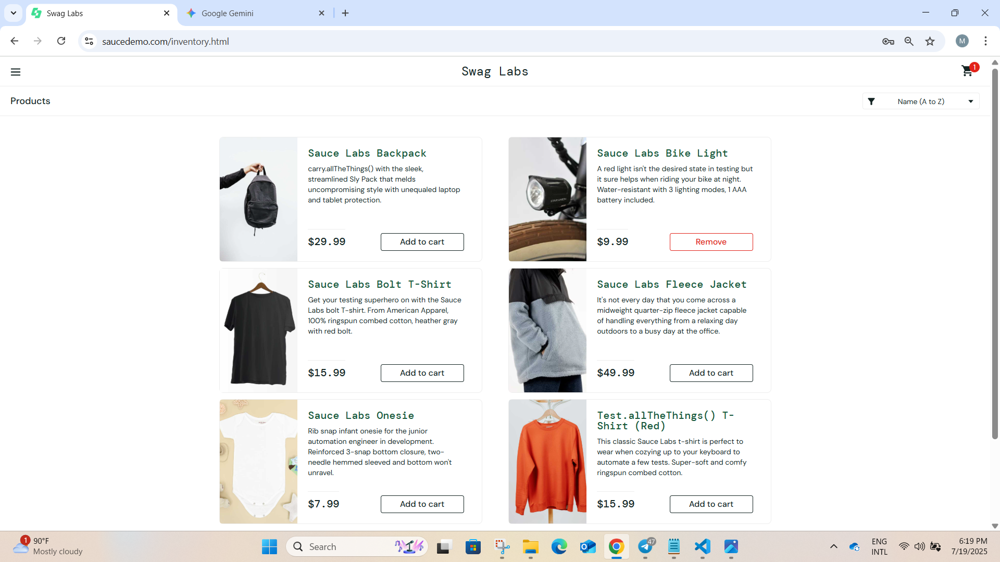
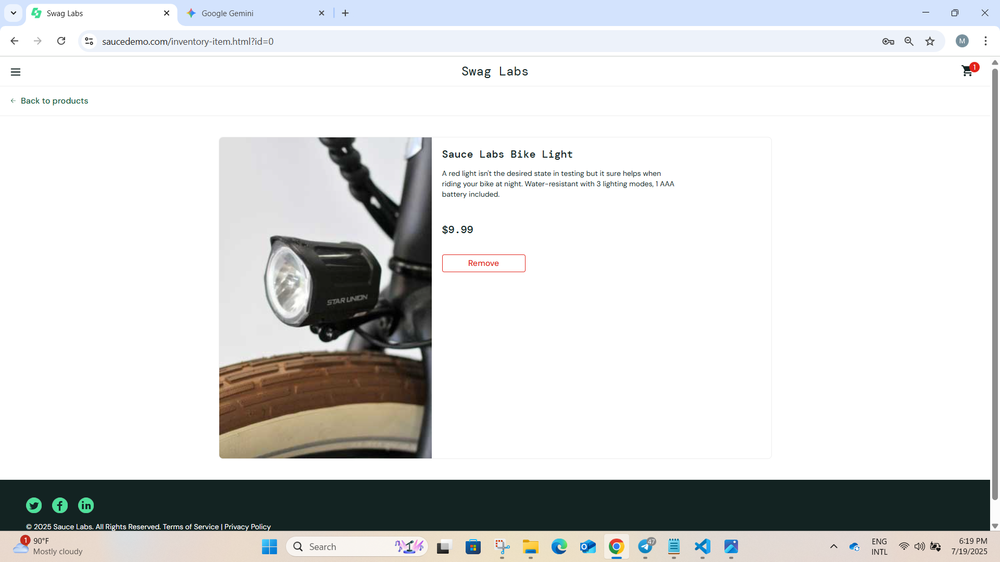
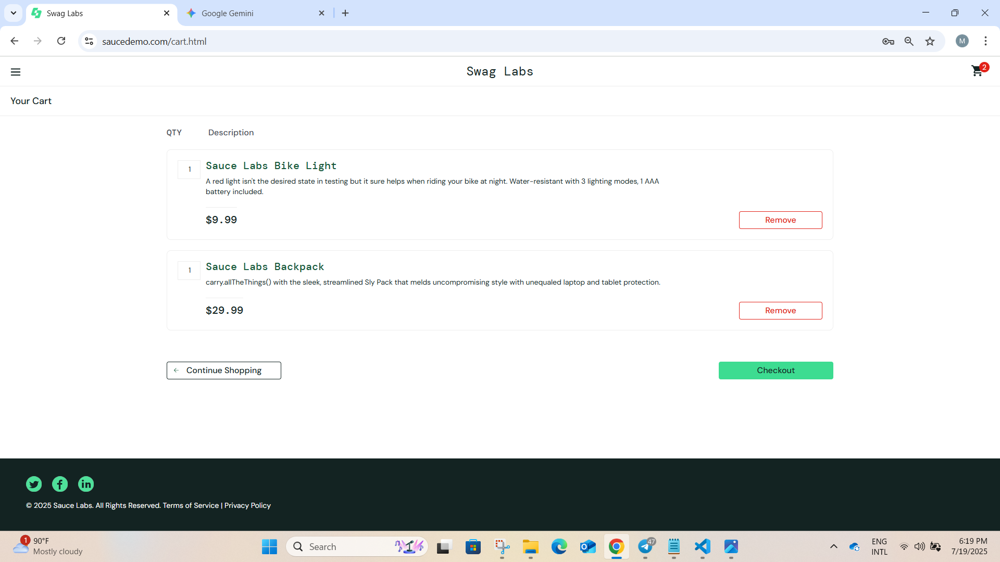
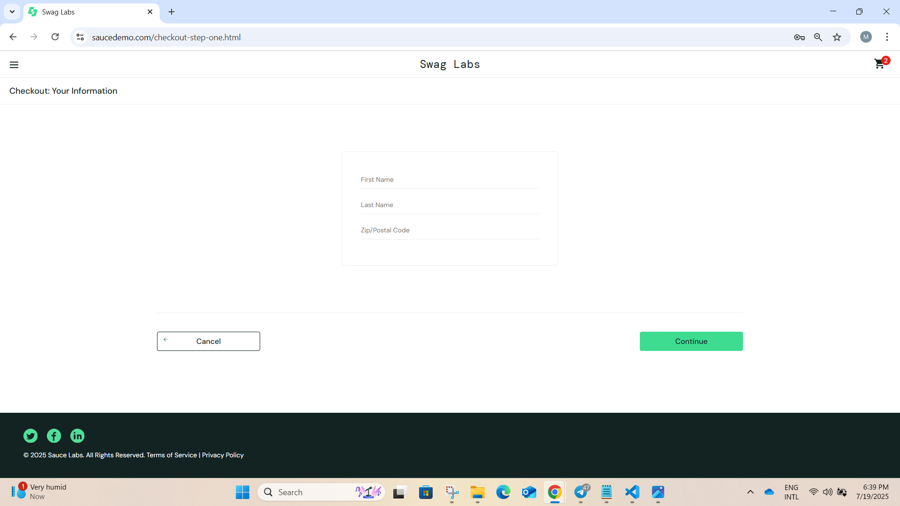
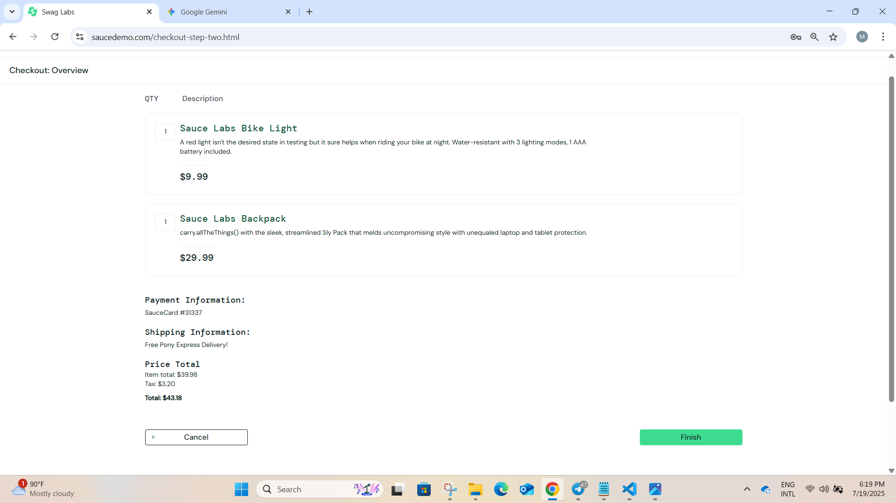
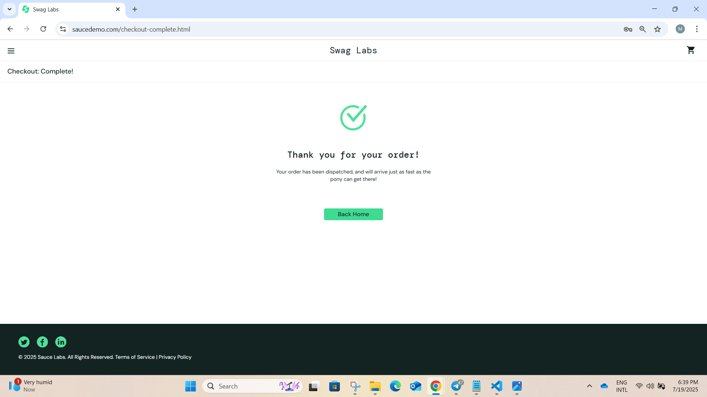

# Swag Labs Functional Overview

**Website URL:** https://parabank.parasoft.com/parabank/index.htm

**Navigation:** Swag Labs is an e-commerce testing platform with a clear navigational structure. Users begin at the **sign-in** page, providing a Username and Password to access the system. Upon successful login, the **product inventory page** is displayed, featuring a list of products. Users can navigate to individual **product detail pages** by clicking on a product, and return to the inventory from there. A persistent shopping cart icon in the top-right corner tracks selected items. On the product inventory page, users can **filter and order products**, typically by name (A-Z, Z-A) and price (low to high, high to low). Items are managed in the **shopping cart page**. From the cart, users can proceed to a multi-step **checkout process** to finalize their purchase. This process requires some personal information before continuing to subsequent steps to complete the order. Additional navigation options, including "All Items," "About," "Logout," and "Reset App State," are accessible via a **hamburger menu** in the upper-left corner.

## 1. Login

1. The login page requires a valid username and password. On successful authentication, the user is redirected to the product inventory page. If credentials are invalid, an error message is displayed and the user remains on the login page.

## 2. Product Inventory

 Displays a list of available products. Users can filter and sort products by name (A-Z, Z-A) and price (low to high, high to low). Each product can be clicked to view details. The shopping cart icon updates in real time as items are added or removed.

## 3. Product Detail

Shows detailed information about a selected product, including image, description, and price. Users can add the product to their cart from this page and return to the inventory.

## 4. Shopping Cart

Lists all items added to the cart, with options to remove items or change quantities. Users can proceed to checkout from here.

## 5. Checkout
The checkout process consists of several steps: (1) The user provides required personal information (first name, last name, postal code) and shipping details. (2) The system validates all fields and displays errors for any missing or invalid input. (3) After successful validation, the user reviews a summary of their order, including items, quantities, prices, and total cost. (4) The user confirms the purchase. (5) Upon confirmation, the system processes the order, clears the cart, and displays a final order confirmation page with a success message and order details.

## Checkout Information

## Checkout Over View

## Checkout Confirmation

## Logout
- Logs the user out and returns them to the login page. The cart and session state are reset.

## Reset App State
- Clears all user data, cart contents, and resets the application to its initial state.
