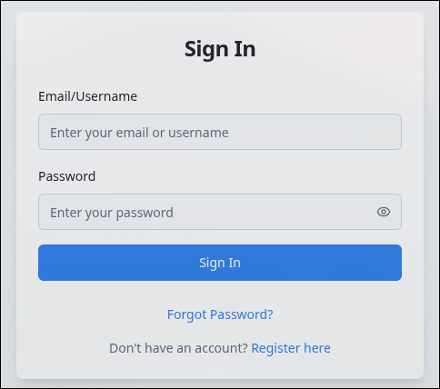
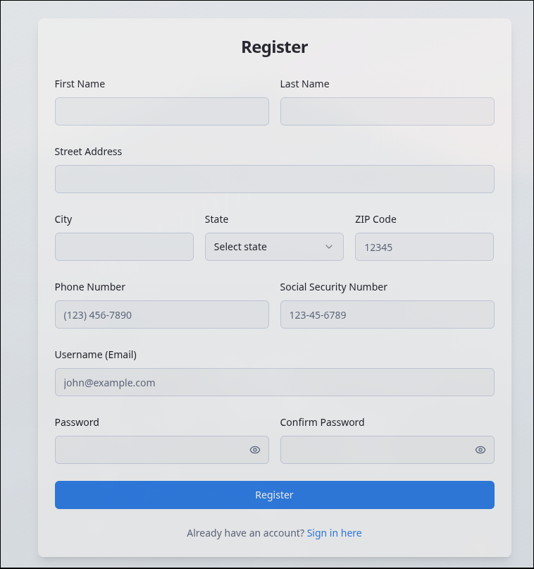
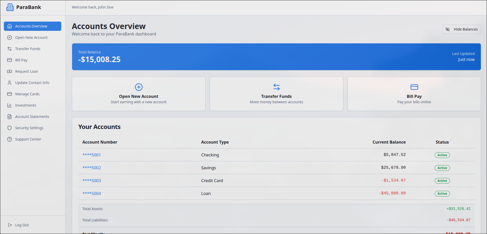
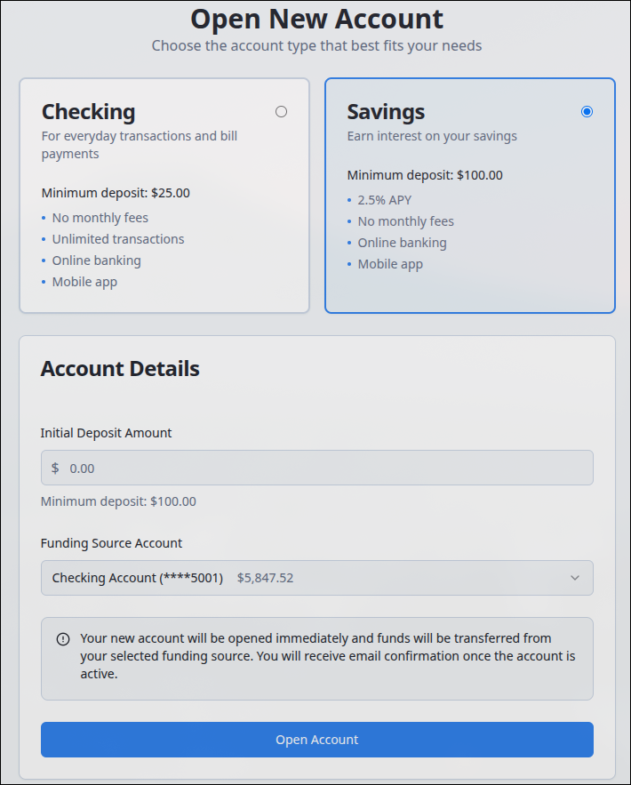
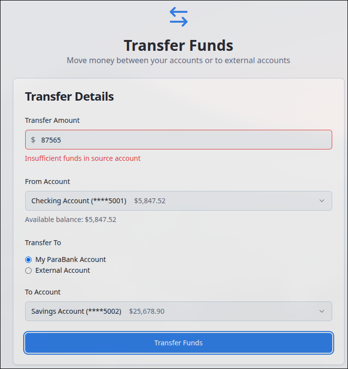

# Mock Data

## Login Credentials

**Email:** admin@parabank.com  
**Username:** admin  
**Password:** Admin123!@#

### Login Screenshot

## Registration

**Note:** No mock data is needed for registration. The registration form validates all input fields and creates new user accounts dynamically.

### Registration Screenshot

## Accounts Overview

### User Profile

**First Name:** John  
**Last Name:** Doe  
**Email:** admin@parabank.com  
**Street Address:** 123 Main Street  
**City:** Springfield  
**State:** IL  
**ZIP Code:** 62701  
**Phone Number:** (555) 123-4567  
**SSN:** ***-**-1234  

### Account Data

#### Account 1 - Checking
- **ID:** 12345001
- **Type:** Checking
- **Balance:** $5,847.52
- **Account Number:** ****5001
- **Status:** Active
- **Open Date:** 2023-01-15

#### Account 2 - Savings
- **ID:** 12345002
- **Type:** Savings
- **Balance:** $25,678.90
- **Account Number:** ****5002
- **Status:** Active
- **Open Date:** 2023-02-20

#### Account 3 - Credit Card
- **ID:** 12345003
- **Type:** Credit Card
- **Balance:** -$1,534.67
- **Account Number:** ****5003
- **Status:** Active
- **Open Date:** 2023-03-10

#### Account 4 - Loan
- **ID:** 12345004
- **Type:** Loan
- **Balance:** -$45,000.00
- **Account Number:** ****5004
- **Status:** Active
- **Open Date:** 2023-04-05

### Account's Overview Screenshot

## Open New Account

**Note:** No mock data is needed for opening new accounts. The form validates all input fields and creates new accounts dynamically with proper validation constraints.

### Open New Account Screenshot

## Transfer Funds

**Note:** No mock data is needed for transfer funds. The form validates all input fields and processes transfers dynamically with proper validation constraints.

### Transfer Funds Screenshot

## Bill Pay

### Quick Select Payees

#### Electric Company
- **Name:** Electric Company
- **Address:** 456 Power Street, Springfield, IL 62701
- **Phone:** (555) 987-6543
- **Account Number:** ELC123456789

#### Gas Utility
- **Name:** Gas Utility
- **Address:** 789 Gas Avenue, Springfield, IL 62701
- **Phone:** (555) 876-5432
- **Account Number:** GAS987654321

#### Internet Provider
- **Name:** Internet Provider
- **Address:** 321 Tech Boulevard, Springfield, IL 62701
- **Phone:** (555) 765-4321
- **Account Number:** INT555444333

**Note:** Users can select from quick payees or enter custom payee information. The form validates all input fields and processes payments with proper validation constraints.

### Bill Pay Screenshot

## Request Loan

### Loan Types Available

#### Personal Loan
- **Interest Rate:** 7.5% APR
- **Amount Range:** $1,000 - $50,000
- **Terms:** 12-60 months

#### Auto Loan
- **Interest Rate:** 4.5% APR
- **Amount Range:** $5,000 - $75,000
- **Terms:** 24-84 months

#### Home Loan
- **Interest Rate:** 3.5% APR
- **Amount Range:** $50,000 - $500,000
- **Terms:** 15-30 years

**Note:** Loan applications require collateral account with at least 20% of loan amount. Credit engine simulates 80% approval rate with various denial reasons for testing purposes.

### Request Loan Screenshot

